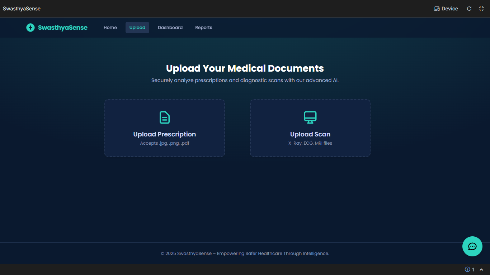
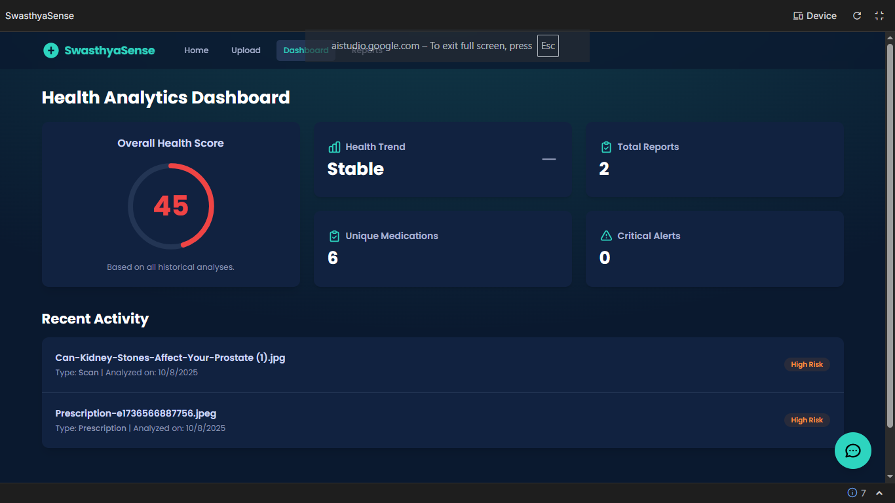

<!-- AIGNITE Banner (centered) -->

  <h1> AIGNITE 2K25</h1>
  
<strong>Powered by MLSC</strong>

---

  <strong>SwasthyaSense</strong> 
  <em>Reflects AI awareness in healthcare</em>

---

## 📖 Project Description
✨ Problem Statement:In today’s healthcare system, prescription errors, fake medical reports, and delayed diagnosis from scans like X-rays and ECGs often put patients at serious risk. Many people struggle to understand complex medical data, while doctors face high workloads and limited time for analysis. There is a need for a reliable AI-based system that can verify prescriptions, analyze medical scans, and simplify reports to improve accuracy, safety, and trust in healthcare.

💡 Proposed Solution:MediVerify AI is an intelligent platform that verifies prescriptions, analyzes medical scans, and delivers easy-to-understand reports. It assists doctors with AI-driven insights, ensures patient safety, and securely manages data on the Microsoft Azure cloud.

🎯 **Target Users / Use Cases:SwasthyaSense is designed for doctors, hospitals, pharmacists, and patients, ensuring accurate prescriptions, faster diagnosis, and safer healthcare for all.

---

## 🔬 Methodology
1. **Research & Ideation** – Studied real-world healthcare issues and brainstormed AI-driven solutions.  
2. **Design** – Created wireframes, UI/UX layouts, and system architecture for smooth user experience.  
3. **Develop** – Built core modules for prescription verification, scan analysis, and reporting.
4. **Test** – Performed unit and integration testing, refined based on user feedback.  
5. **Deploy** –Deployed prototype on cloud (Azure) and monitored performance metrics
6. **Future Scope** – Plan to add real-time doctor–patient chat, wearable data integration, and multilingual support.

---

## 👥 Team Details
**Team Name:** `Team Mega`

| Name | Role | Email |
|---|---:|---|
| B.Vineeth Kumar| Team Lead | vineethbandari20@gmail.com |
| G.Pranav Charan| Team Member|pranavcharang@gmail.com |
| T.Ram Charan| Team Member | thiriguduramcharan@gmail.com|
| V.Bhargav| Team Member |bhargavvandhanapu@gmail.com |

---

## 🛠️ Technology Stack
`React and TypeScript single-page application (SPA)` | `Google Gemini API ` | `Tailwind CSS` | `IndexedDB` 

---

## 📹 Demonstration Video
▶️ https://drive.google.com/file/d/1cwuX--hrP9WinkZ-Nw2s5LgEJ4BaNLZa/view?usp=drivesdk
---

## 📚 References
Microsoft Azure AI & Cognitive Services Documentation – for AI model integration and deployment

TensorFlow & PyTorch Official Docs – for deep learning model development and training

OpenCV Library – for image processing and scan analysis

World Health Organization (WHO) Reports – on medical errors and patient safety statistics

Research Papers on AI in Healthcare – IEEE, Springer, and PubMed sources for medical AI applications

OpenAI API Documentation – for natural language processing and report summarization
---

## 🖼️ Assets / Screenshots

   
  

---

  <b>Hackathon:</b> AIGNITE 2K25 | Organized by MLSC 

